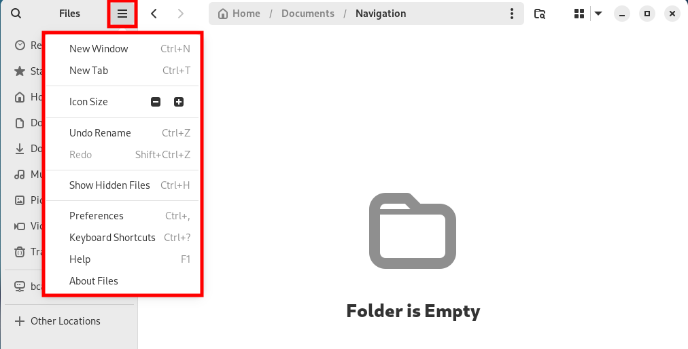

# GUI

Navigation through the GUI is simple and intiutive after the customisation of the Desktop with the inclusion of the `Places` dropdown menu on the top taskbar. This provides shortcuts to some of the most common locations to save and access files such as `Documents` and `Downloads`.

Select the `Documents` option under the `Places` dropdown menu. This opens the File Manager GUI.

Within the File Manager GUI, folders can be created, though files cannot.

`Right click` inside of the File Manager GUI to display the available options, then select `New Folder...` and enter `Navigation` as the Folder Name in the field provided.

Navigate into the newly created folder by `Double clicking` the Navigation directory.

You will also notice the Navigation Sidebar to the left of the File Manager window which contains shortcuts to recent or common directories.

At the top right of the File Manager sidebar, you will notice a `Hamburger Menu` button. 
This provides options for the File Manager such as opening a `new window or tab`, changing `icon sizes`, or showing `hidden files`.

