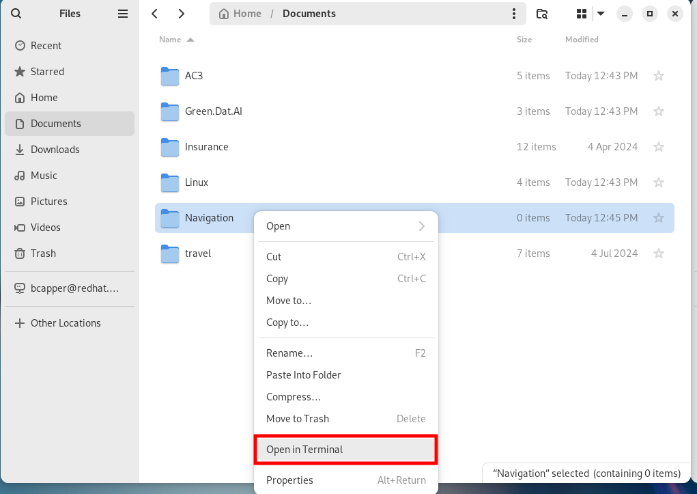
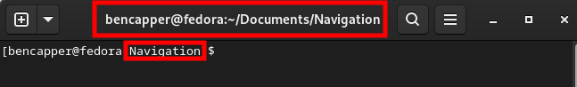

# Terminal

In this section, you will learn to create files in the terminal as this cannot be done in Fedora through the GUI. You will then be guided through navigation options for the terminal.

## Creating Files

Since Fedora does not have an option to create files via the GUI, you must now use the terminal to create a file inside of the `Navigation` directory.

To open the terminal, inside the `Navigation` folder you created, `right click` and select `Open in Terminal`. This will open the terminal inside of `Navigation`.



You can see that the terminal location is pointed at the folder you just created in the application bar and in the terminal after the hostname.



There are many terminal commands to create files but we will focus on the most common and simple options.

Type `touch sample.txt` into the terminal and press the `Enter` key. This will create an empty text document which can be manipulated through either a GUI editor or via the terminal.


Type `echo "sample text" > sample2.txt`.


---

## Navigation

**Absolute Paths**: An absolute path starts from the root directory and gives the full address of the target folder, like `cd /home/user/Documents`.

**Relative Paths**: A relative path starts from your current location. So, if you’re already in the home directory, you can use `cd Downloads`.

To navigate in the terminal, the `cd` (Change Directory) command is used, followed by an option which specifies the path location. 

For example:

```
cd ..          (This moves up one level, so if you're in Downloads, cd .. takes you back to your home directory).
cd ~/Downloads (This moves to the Downloads folder inside your home directory).
cd ~           (This moves to the home directory)
cd -           (This moves to the previous directory)
```

If already inside the home directory denoted by `~`, you can move into the downloads folder using `cd Downloads`. If you are in a different folder such as ~/Documents, you must specify the full path of the folder you wish to move to: i.e `cd ~/Downloads`
