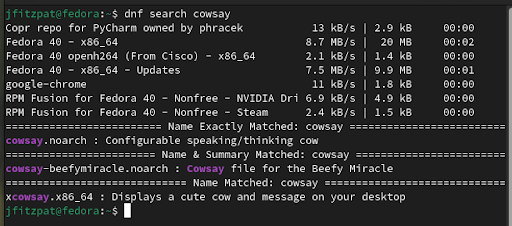
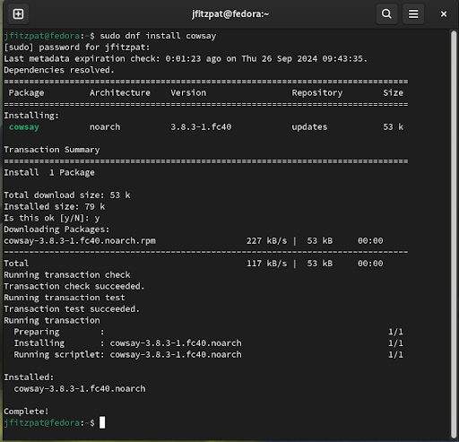
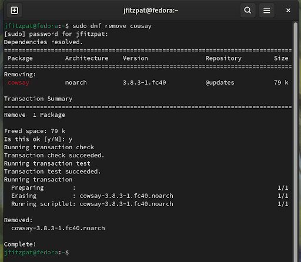

# Installing an application

A Linux distro will have a package manager.
These package managers can differ from distro to distro, but their principles will be the same.
On Fedora the package manager is called `dnf`.

This lab will cover the three main functions a user will use a package manager for, search, install and remove.
The application `cowsay` will be used to show these features.

## Searching for an application.
When using the search, the search term is the application name or partial application name.
This will mean more results can be returned that only the application being search for.

To search for the `cowsay` application run the following command.
```sh
dnf search cowsay
```

This will return a list of applications that contain the word cowsay as seen below.
<details>
  <summary>Note</summary>
  Application names will never have spaces in the names, but `dnf` can be smart enough to combine the words.

  Run the follow command and compare the difference in the output from the previous command.
  ```sh
  dnf search cow say
  ```
</details>



## Installing an application.
Once the full name of the application is known it is time to install the application using `dnf`.
The full name will be the name given in the search results.
`sudo` is required to run the installation command.

The following command will install `cowsay`
```sh
sudo dnf install cowsay
```

When running the command two prompts will be give to the user.
The first prompt will be from `sudo` asking for the user password allowing permission to run the installation.
The second prompt comes after `dnf` gives a summary of what will be installed, asking is it okay to continue.
At this point the installation can be canceled.



Once installed all users on the system will have access to the `cowsay` application.

## Removing an application.

The removing of an application is the opposite of the installation process, and follows the same rules.

- `sudo` is required to give permission.
- The exact name of the application is required.
- The application will be removed for all system users.

To remove `cowsay` can be done with the following command.
```sh
sudo dnf remove cowsay
```

Running the command will give the users two prompts like the `install` command.
The first prompt again, will be from `sudo` asking for the user password allowing permission to run the removal.
The second prompt again, comes after `dnf` gives a summary of what will be removed, asking is it okay to continue.
At this point the removal can be cancelled.




