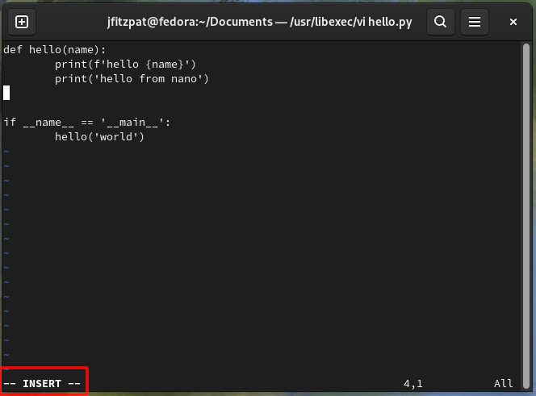

# Vim terminal editor

Vim is a family of editors, where there many variants.
On Fedora it is called `vi`. 
This is alias for `vim` variant.
There are others in the variants like the newer NeoVim.

## Opening files in vi

Like nano, vi is a terminal application and is opened from the terminal.
Again like nano, opening or creating files with vi is done by calling the application followed by the name of the file.
```sh
vi hello.py
```


As we can see there is no syntax highlighting.
This is not a limitation of vi, but a configuration choice for the user.

## Moving around the file
Again lets add a print statement after the last print statement, but first we have to navigate there.

When the file is opened the mode is set to `NORMAL` mode, this allows moving around the file.
The `h`, `j`, `k` & `l` keys are used to move the cursor around within the file.
These key bindings do the following movements; left, down, up & right.
With these key bindings move to the last print statement as shown below.


## Editing the file
There are three main ways to start adding to the file.
These are `insert`, `append` and `new line`.
In our case `new line` best suites what we want to do, but before we do that, let's explain the others.

The `insert` will allow you to insert text before the current character the cursor is on.
We enter this mode by pressing `i`.

`append` is the opposite, the text is added after the current character the cursor is on. 
This mode is entered by pressing `a`.

`new line` starts a new line at the start of the line below the cursors position.
We enter this mode by pressing `o`.
Go ahead and press the `o`.



Notice at the bottom of the window, vi gives a status to which mode is active. 
It now in `INSERT` mode.

Use tab to move the cursor across under the existing print statements and add `print('hello from vi')`.
At this stage the edits are done, and we want to switch from `INSERT` mode back to `NORMAL` mode.
This can be done by pressing the `ESC` key.


Notice how when vi is in `NORMAL` mode there is no status indicator like there was in `INSERT` mode.

## Saving the changes
The next step is to save the file, or to write the file.
This can be done in `COMMAND` mode with `w`.

To get into `COMMAND` mode press `:` while in `NORMAL`.
Add `w` to the command and press `ENTER`.
This will save the file and the output from the command will display details on what happened. 
In this case the size of the file that was saved. 


## Exiting vim
This is the one task that catches people out the most, and is the source of lots of memes.
It is however very simple once you know how.

The command `q` is used.
From `NORMAL` mode switch to `COMMAND` mode using `:`, and enter `q` followed by `ENTER`.
This will exit vim and bring you back to the command line.

There are a few rules.
Vim will not allow you to exit if there are unsaved changes in the file being edited.
In this case there are two options, save or discard the changes.

To save the changes while quitting we can chain the commands.
This looks like `:wq ENTER`.

Discarding changes is also done with chained commands, and is `:q! ENTER`.
