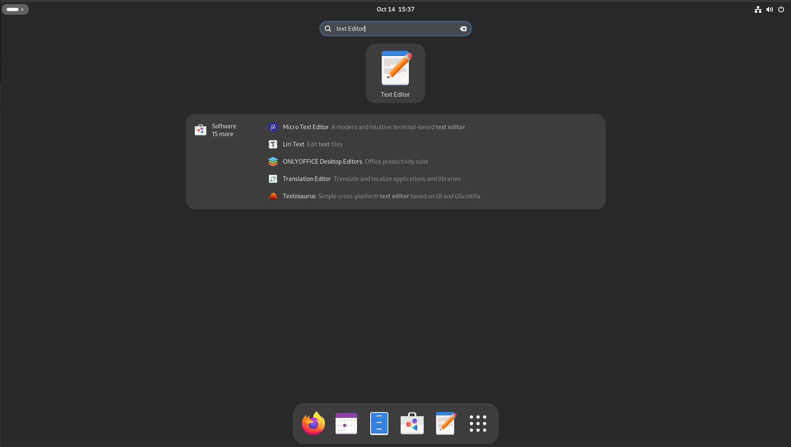
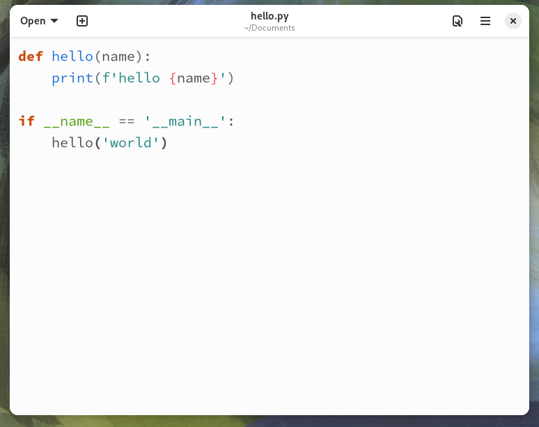

# Text Editor

On Fedora the default GUI text editor is called **Text Editor**.
In this Lab we will look at opening **Text Editor** and edit some files.

## Opening **Text Editor**

Open the application menu and start to type in `text editor`.
This searches all applications and narrows down to the **Text Editor**.
Press enter will opened the application. 



## Creating the first file

The creating of a file is as easy as you expect it to be.
Type the following into the editor.

```
def hello(name):
    print(f'hello {name}')


if __name__ == '__main__':
    hello('world')
```

What you will notice at this point the is no syntax highlighting.
This is because the editor does not know what language the to use for the syntax highlighting.

Saving the file as `hello.py` and the syntax highlighting.
Save this file in your Documents as it will be used in the next steps of this lab.

Once the file is saved it should look like below.

