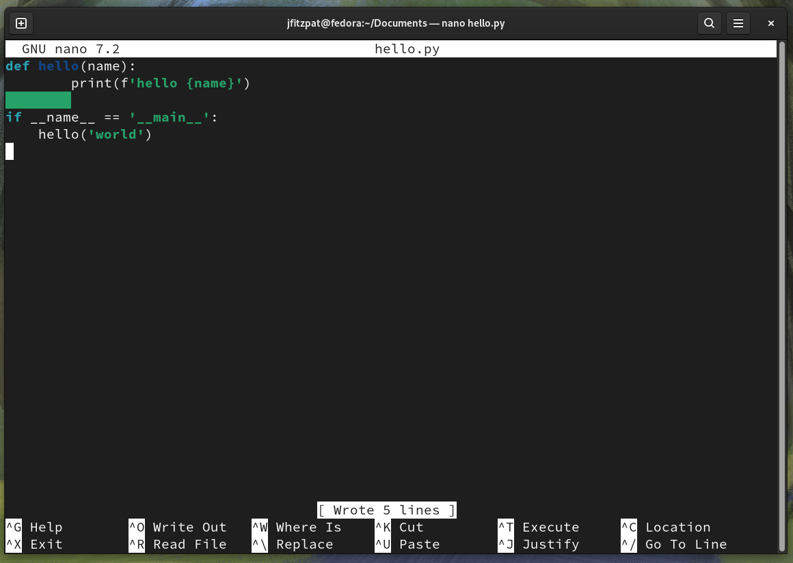
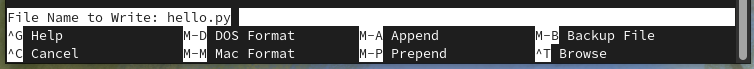

# nano terminal editor

Nano is a terminal editor that can be used to edit files from within the terminal. 
In this lab we will edit the same file from the last example.
Most of the time we work with existing files over creating new files.

## Opening files in nano
As nano is a terminal application we need to open the terminal first.
Once in the terminal, the command below will open the file `hello.py` that was created in the last step. 
```bash
nano hello.py
```
The command will open the existing file, but also if the file does not exist it will create the file. 
From the start we can see that there is syntax highlighting.
This is because of the `py` exestion on the file.



Add a line below the `print(f'hello {name}')` which says `print('hello from nano')`. 
As this is a python file the tab spaces matter, make sure the starts of the `print` line up.
File should look like below.


Now to save the changes to the file.
Press `CTRL + O` will bring up a prompt asking for the file name.
As we want to keep the existing name press `ENTER` will save the changes.




## Exiting nano
To exit nano the `CTRL + X` key combination is used. 
If there were unsaved changes this would ask if we wanted to save the changes to the file.
