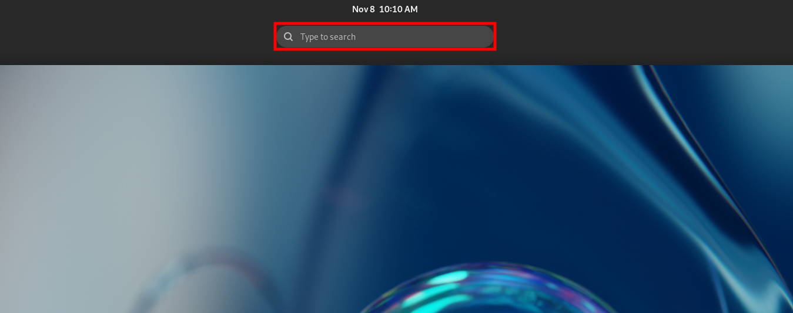
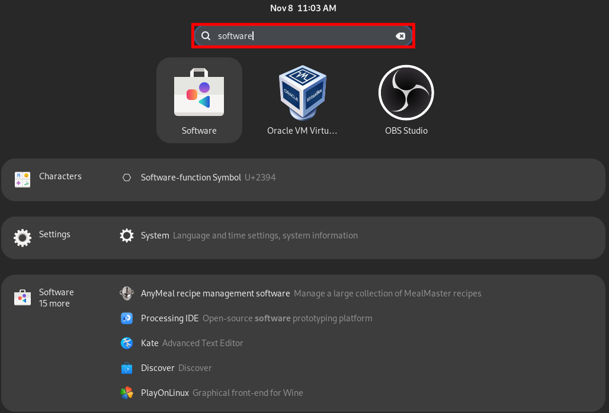
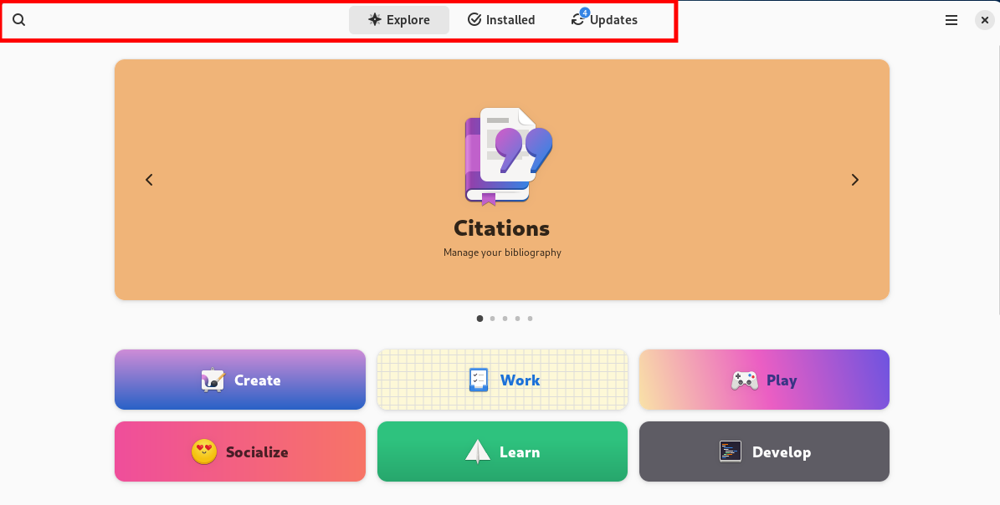
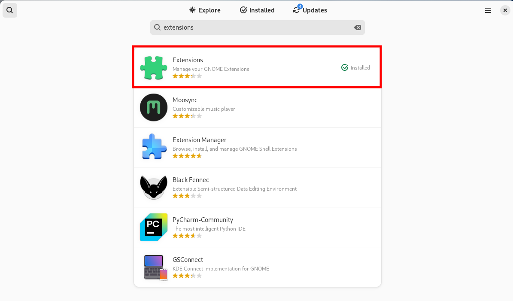
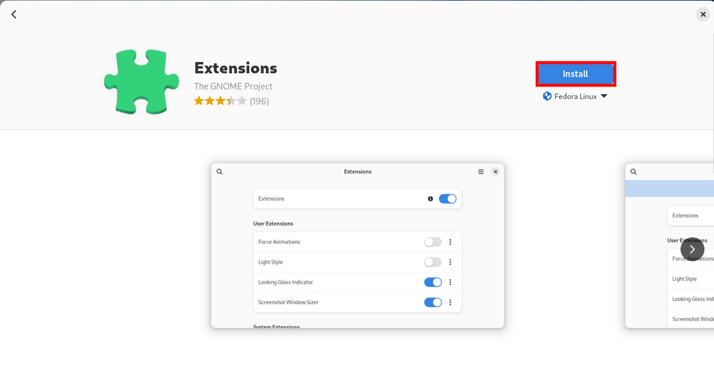
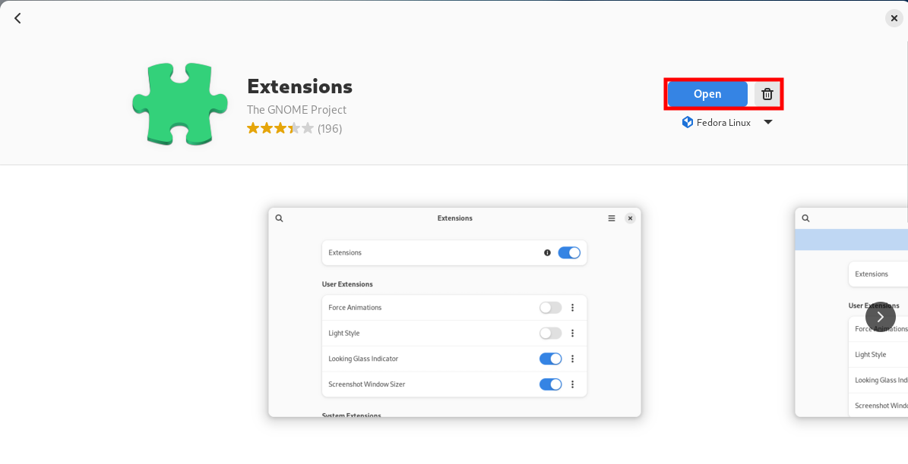

# Installing Applications

Select the `activities` button to the top left of the Desktop.

After pressing the `activities` button, the recent applications taskbar becomes active on the bottom of the screen, and a search field will appear to the top.
 

In the search field, entering `Software` will filter installed applications. 
The `Software` application in Fedora is where applications can be installed, updated, or uninstalled. 

Select the `Software` application to open it.
 

Inside of the software application, you may search the catalogue for a specific application with the button on the top left of the window. 
To view installed applications or their updates, the middle tab bar can be used. 

Select the search button, then type `Extensions`.
 

This will show a list of applications which match the search criteria. 

Select the first option: `Extensions`.
 

This panel provides information about the application and allows you to install the application. 

Select `install`.
 

The `Extensions` application can now be opened and used. 
This can be done by selecting `Open` on the Sotware application window, or by searching through applications after selecting the Desktop `Activities` button.

Open the application.
 