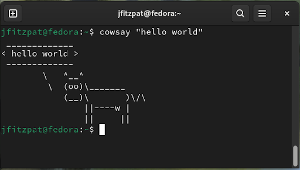

# Running the application

Now it is time to run an application. 
If you are following along with this lab, there will be a problem at this stage.
During the last stage of the [Installing an application](https://tutors-svelte.netlify.app/#/lab/tutors-doc.netlify.app/topic-02-terminal/unit-1/book-a/02.02), the application that is about to run was removed using `dnf`.
This is okay, go back and install `cowsay` again.
It is good to practice using these tools.

Now that `cowsay` is reinstalled, it is time to run it.
```sh
cowsay "hello world"
```

<details>
  <summary>Note</summary>
  It is good pratice to wrap strings in quotes as a lot of applications will see every word as an individual agurment to the command.
  `cowsay` however does not do this.
  `cowsay "hello world"` is equal to `cowsay hello world`.
</details>



What you may have noticed by now is run `cowsay` was no different from running `dnf`.
Yes, in some case `dnf` required `sudo`, but this is a form of chaining applications. 
All application are launched in the same fashion, the words used to build the commands maybe different, but the process is the same.

